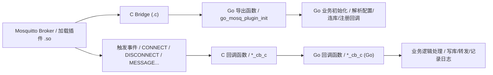
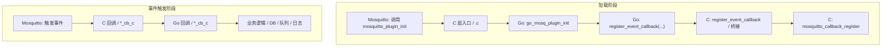
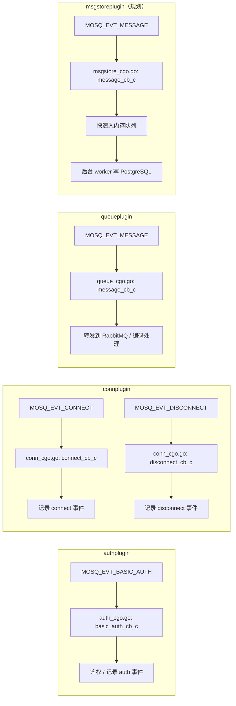

# 插件调用流程图

本文件描述本项目插件从 Mosquitto 到 Go 业务逻辑的调用链，并给出更细的注册与事件流转图。

## 总览：从 Mosquitto 到 Go 业务逻辑

## 细化：注册回调与事件路径

## 各插件事件差异

## 关键桥接点说明

- `.c` 文件负责：
  - 提供 Mosquitto 期望的 C ABI 入口（`mosquitto_plugin_version/init/cleanup`）
  - 统一封装 `register_event_callback`，内部调用 `mosquitto_callback_register`
  - 提供 `go_mosq_log` 等包装，避免 Go 直接调用 C 可变参函数
- `.go` 文件负责：
  - 业务逻辑与配置解析
  - 事件回调实现
  - 与外部系统交互（数据库、队列）
